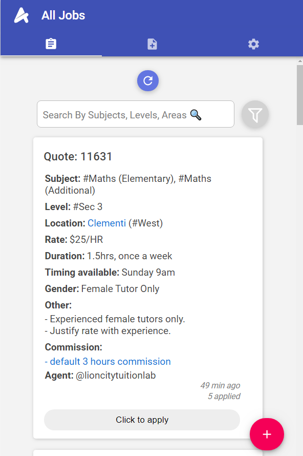
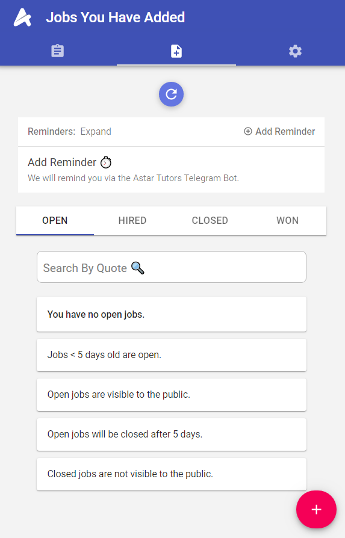
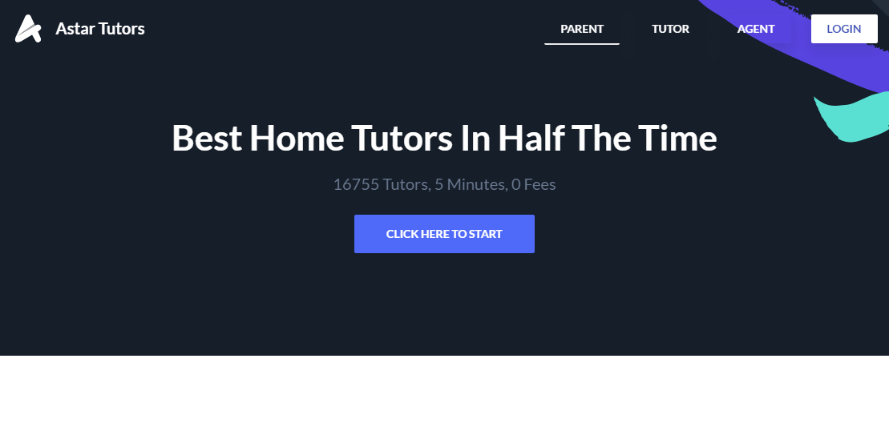

  
  

[Astar Tutors](https://www.astartutors.sg/) is a web application that I helped create as a collaboration. The project helped me learn how to design and implement a responsive web app.

Astar Tutors front end is primarily written using react and components used are from material-ui.

The backend is written in Typescript. I was also tasked with implementing the backend code for local login and registration using passport.js as well as having a frontend interface for users to login and register.

This project was one of the more challenging ones because I am not that familiar with many concepts and technologies used. This includes trying to learn Jest for react testing and reading up on Typescript so that I can incorporate it into my javascript code.

I gained experience with full-stack web application design and associated technologies, including MongoDB for database storage.