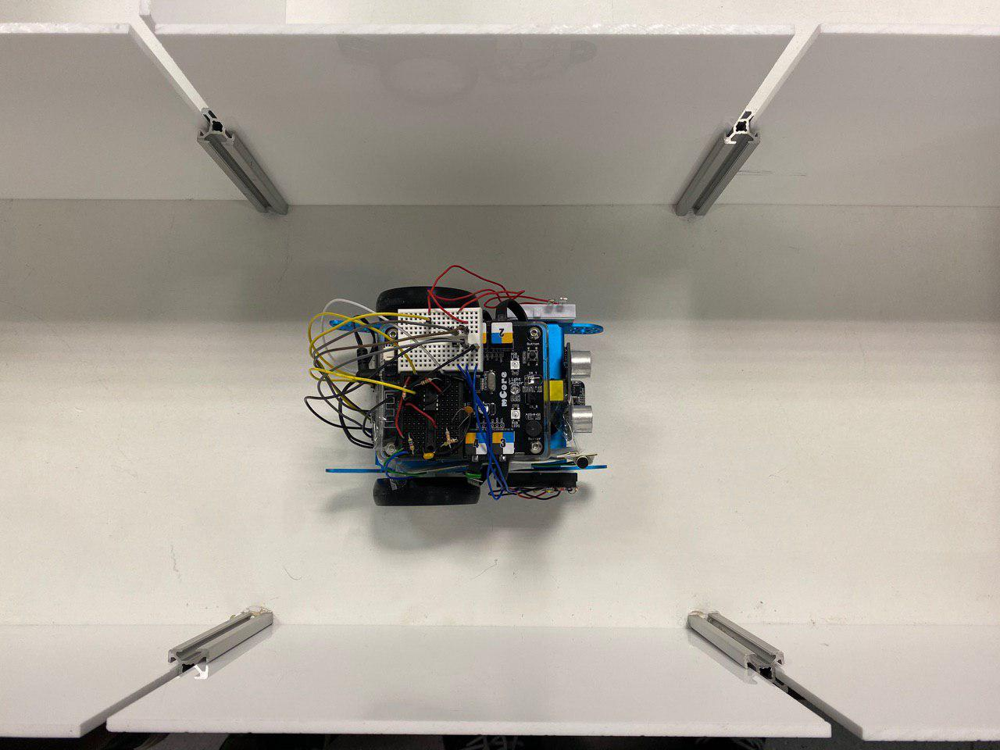
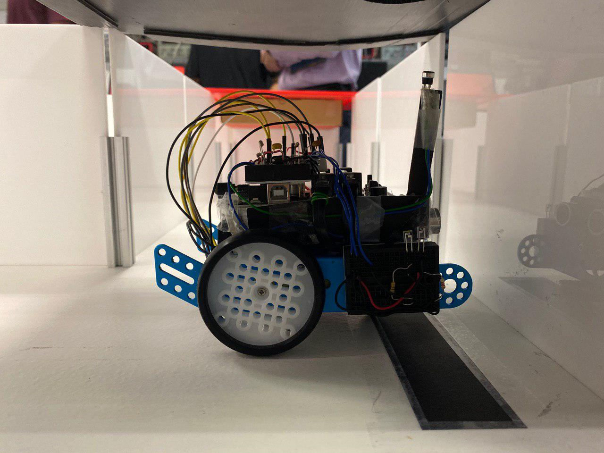
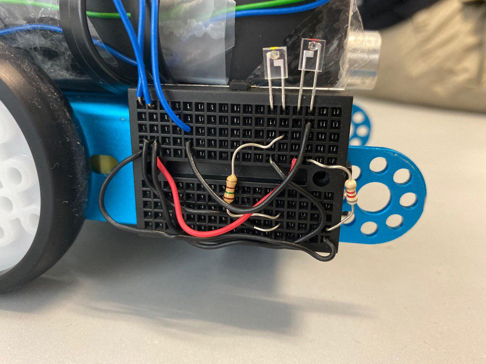
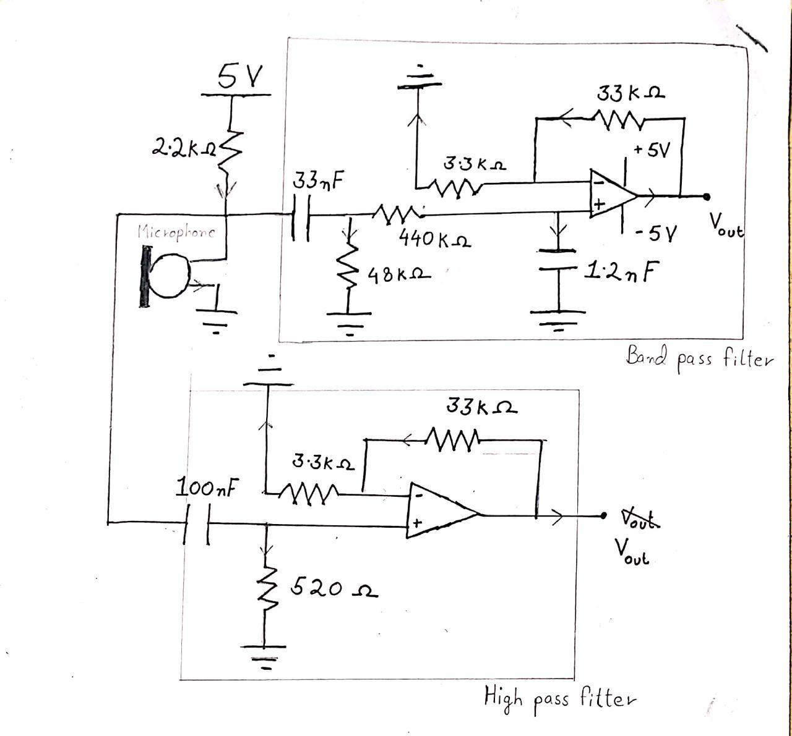

<div class="ui medium rounded images">
  
  

</div>

The goal of the amazing challenge is for our robot to complete all challenges in the maze and reach the end point without bumping into any walls. There are two types of challenges: colour and sound challenge. The colour challenge requires the robot to read the RGB values via the light sensor to correctly determine the colour. The color determines which direction the robot has to turn. The sound challenge requires the robot to determine if sound played is a high or low frequency sound.



To prevent the robot from bumping into walls, we have installed infared sensors at the side of the robot. If the sensor detect that the distance between the robot and the wall is too close, it will instruct the robot to turn away from the wall by slowing down the wheel that is furthur away from the wall. This uses a simplified algorithm of a PID controller. This is done by measuring the initial value of the IR sensors when it is centered. As the robot moves about the maze, the speed is then altered based on how large the difference is. This way the robot will stay centered during the couse of the maze.

For the color sensor, we needed to calibrate the sensor carfully as we also need to account for the ambient lighting in the room. The colour sensor works on the basis that each colour of the RGB LED lamp, red, blue and green, is turned on at short intervals, which shines directly onto the colour board. A value is then read by the light sensor based on the intensities of the reflected colour lights from the board. The light sensor takes the average of 5 readings to ensure the value is more accurate but also to ensure time would not be wasted on reading the values.



For the sound challenge, we constructed a band pass filter for the low frequency sound and a high pass filter for the high frequency sound. We have a microphone attached to the robot to pick up the sound.

Here is some code that illustrates how we read keep the robot moving straight:

```js
double pconstantLeft = 1.25;
double pconstantRight = 1.16;

void readDistance() {
    irRight = IR.aRead1();
    rightError = irRight - centerRight;
    irLeft = IR.aRead2();
    leftError = irLeft - centerLeft;
}

void irSensor() {
    readDistance();

    // if moving towards the right
    if (rightError < -15) {
        // decrease leftwheel speed for a few seconds
        leftwheel.run(-motorSpeed - ((double) rightError * pconstantRight));
    }
    // if moving towards the left
    else if (leftError < -15) {
        // decrease rightwheel speed for a few seconds
        rightwheel.run(motorSpeed + ((double) leftError * pconstantLeft));
    }
    if (lineFinder.readSensors() < 3) {
        sensedBlack();
    }
    delay(30);
    goStraight();
}
```

Source: <a href="https://github.com/AndreWongZH/CG1111_final_project"><i class="large github icon "></i>AndreWongZH/CG1111_final_project</a>


