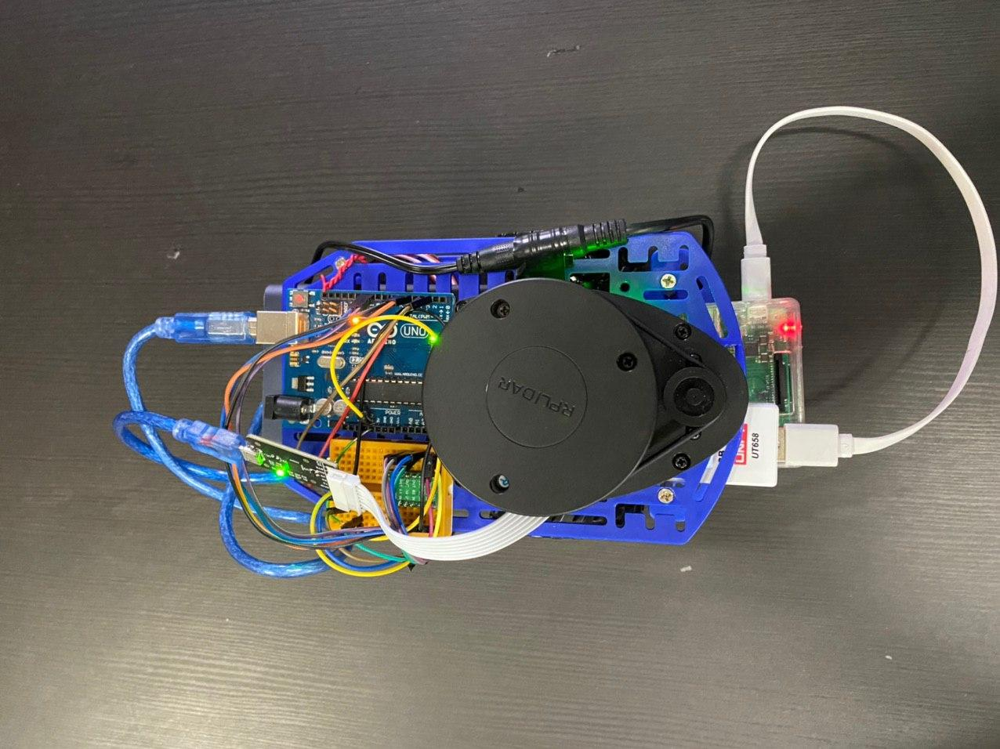
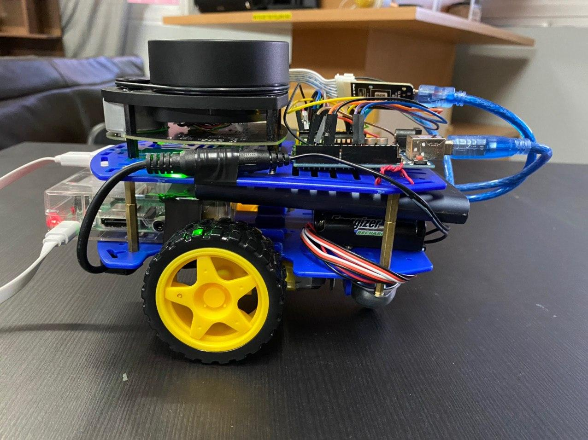
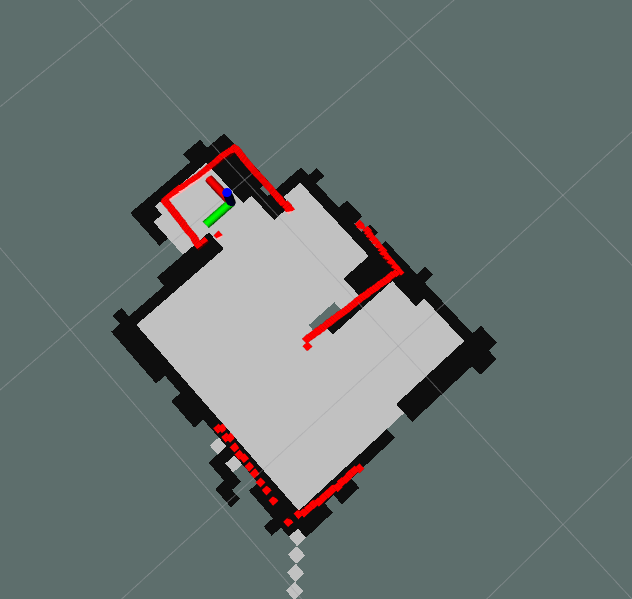

  
  

For my CG1112 final project, we were tasked to construct a robot to navigate a flat terrain and search for survivors.

The robot is being controlled from another laptop via TLS connection and we are able to instruct the robot to move forward, backwards and rotate left and right. This is possible as the the arduino is connected to the Raspberry Pi, sending the motor signals on how to turn.

We have a LIDAR which is able to do a scan around our surroundings and this information is then sent to another laptop via SSH which is running the Robot Operating System (ROS). An image of the surrounding will then be mapped out using ROS RVIZ as shown below. We also used the Hector SLAM algorithm when scanning using the LIDAR so that it keep tracks of its current position as it moves.

Below is a video that gives the summary of the movement and mapping of the lidar.
<video width="600px" controls>
  <source src="../images/cg1112/project_vid.MOV" type="video/mp4">
</video>

This was one of the hardest projects I have done because configuring the USART of the arduino was difficult and there were many concepts we had to use, like ROS, TLS and LIDAR.

Source: <a href="https://github.com/AndreWongZH/Alex-01-01-02"><i class="large github icon "></i>AndreWongZH/CG1112_final_project</a>

