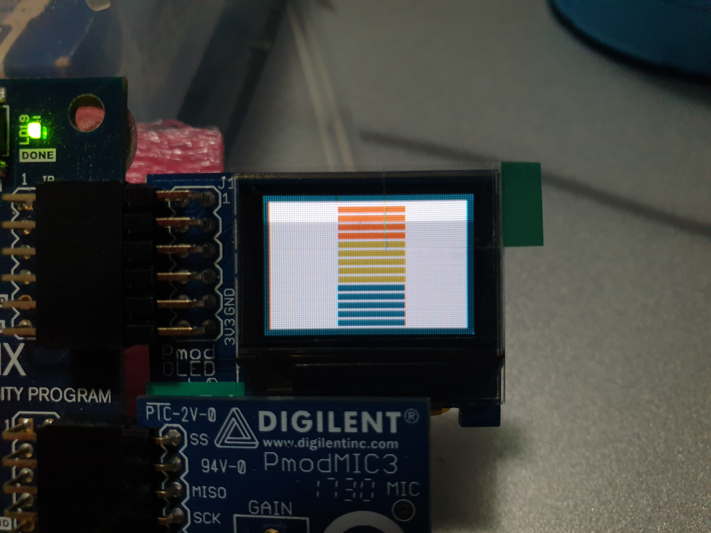
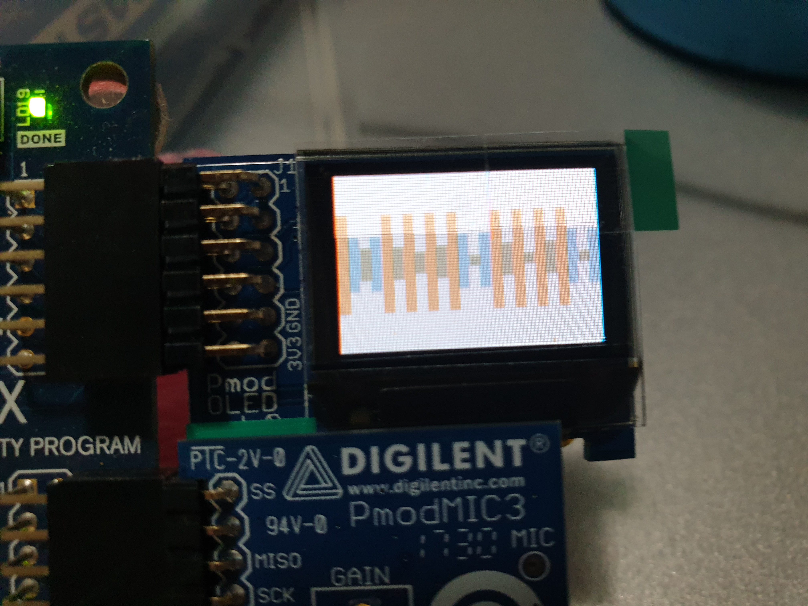

For our EE2026 final project, me and my project partner are suppose to design a home sound and entertainment system using our Basys 3 board together with a mic and OLED display.

  
  

One of the features we did was a voice detection system that will detect the loudness of our voice. It will then display the horizontal sound bar on the OLED which will change colour based on the loudness of the voice. It will also display the number on the 7 segment display corresponding to the loudness. We then replicated the same function using a vertical sound bar.

Our second feature was displaying the nyan cat. In the default mode, our nyan cat will be animated through a series of frames. We can pause the cat, make the cat grow or shrink depending on the switches toggled.

Lastly, we also created a mini platformer game that is similar to the Google dinosaur game. The player must jump over the obstacles and we will keep track of their scores.

In conclusion, EE2026 was a pretty fun mod that exposes us to programming using Verilog.

Source: <a href="https://github.com/iamchenjiajun/EE2026-FPGA-Design-Project"><i class="large github icon "></i>EE2026 final project</a>

