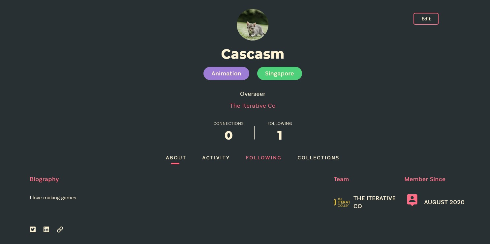
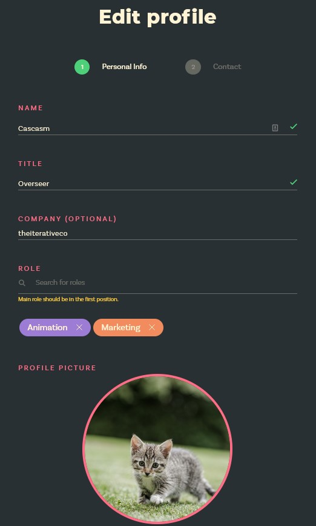
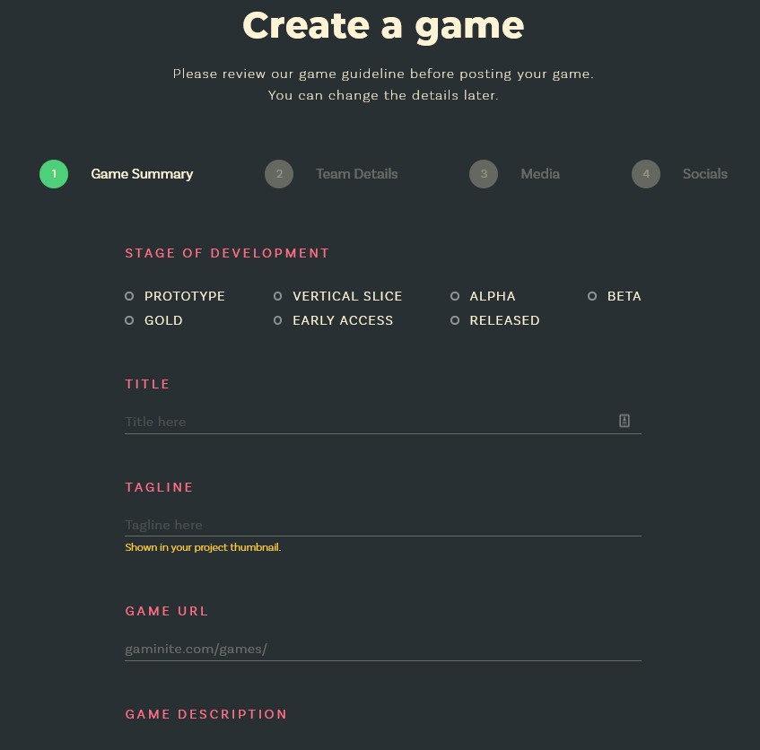
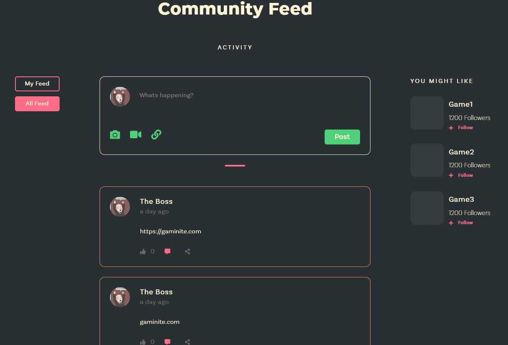

  
  

For my summer internship, I worked on developing a web application for users to upload games that are created by themselves. Other users are also capable of following the game's development updates. Users and companies can also showcases their list of games that they have developed or invovled in.

The front-end of the website was created using NextJs and it is linked to the backend using Apollo Client. Apollo Client was new to me and it took me quite alot of learning to get started. NextJs was also new to be but fast to pick up. It provided faster serving of webpages because of its server side rendering.

The backend was developed on ExpressJs with Apollo GraphQL.

We also used an external api getstream.io to handle real time feeds of users, companys and games.

Futhermore, I also learnt more about DevOps such as deploying our front and back end application onto Digital Ocean Services and handling image uploads with Droplet containers. We also have meetings once every two weeks where we discuss about what we have done the previous weeks and plan for new feature to implement next week.