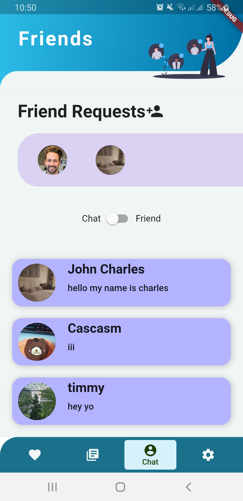
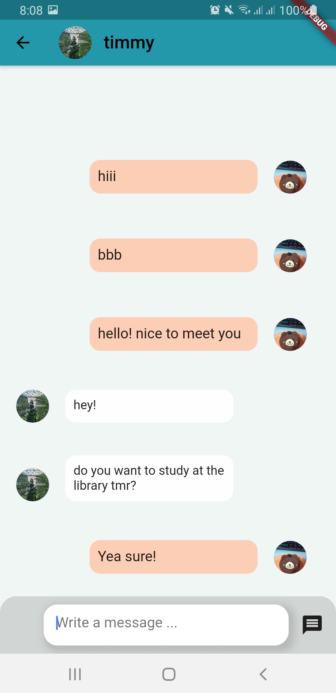

In this project, my partner and I created a Flutter application. We also have a Firebase backend to handle authentication and storing user information and chats.

We created a page for users to looking for potential friends to study with. They can then send a friend request and wait for the other person to accept.

Once the other person has accepted, they can then chat together in the chatroom page. This allows them to plan a time and place for them to meet up and study together.

Lastly, students who want to find tutors can also do so by searching on our tutor page. User can then send the tutor a request and they can then discuss more on the location and rates of the tuition.

This project allowed me to apply software engineering principles such as SOLID principle, DRY principle, defensive programming, SCRUM meeting and many more. I also get to implement automation in CI/CD using Travis CI and testing using the standard Flutter test kit

Source: <a href="https://github.com/TwoGeeks/TwoGeeks"><i class="large github icon "></i>Orbital 2020</a>