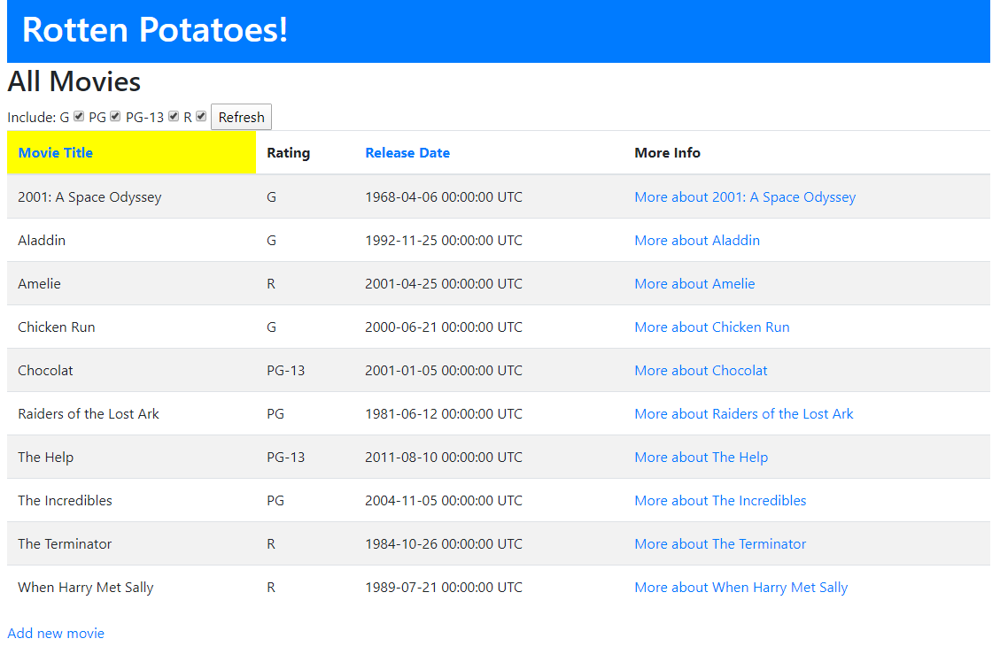

Rotton Potatoes is a mock movie record web application built from edX course [Agile Development Using Ruby on Rails - The Basics](https://www.edx.org/course/agile-development-using-ruby-on-rails-the-basics). This project help me to learn how to design and deploy a ruby on rails website.

Rotton Potatoes is able to add movies with their title, rating, release date and description to a database managed by Sqlite3.
It is able to edit details about the movie in the database and delete any movie.
When displaying the list of movies to users, it can sort the movies alphabetically by movie title or by release date.
It can also filter out movies based on the ratings indicated.

I gained experience in writing test using rspec and cucumber. Ensure all the test passed in the rspec and also came up with user scenarios when they use the app.

This web application is deployed on heroku: [Rotton Potatoes](https://powerful-crag-39075.herokuapp.com/)

Source: <a href="https://github.com/AndreWongZH/rottenpotatoes-rails-intro"><i class="large github icon "></i>AndreWongZH/rottonpotatoes-rails-intro</a>
