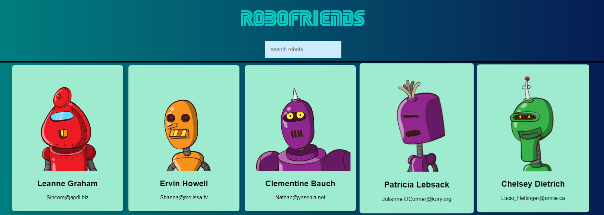

Robofriends is a simple project that I build after learn the fundumentals of react. It has several stateless and stateful components that made up the app.

It also has its own state that detects changes in the searchbar when a user types in. Users can then search for a robot with a specific name.

This project also includes an API call to Jsonplaceholder to fetch mock names and email addresses.

Checkout the web-app over [here](https://andrewongzh.github.io/robofriends/)

Source: <a href="https://github.com/AndreWongZH/robofriends"><i class="large github icon"></i>Robofriends</a>