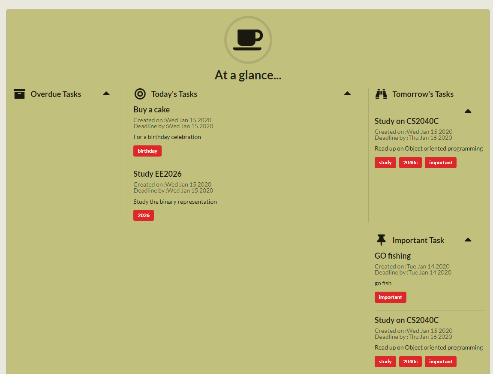
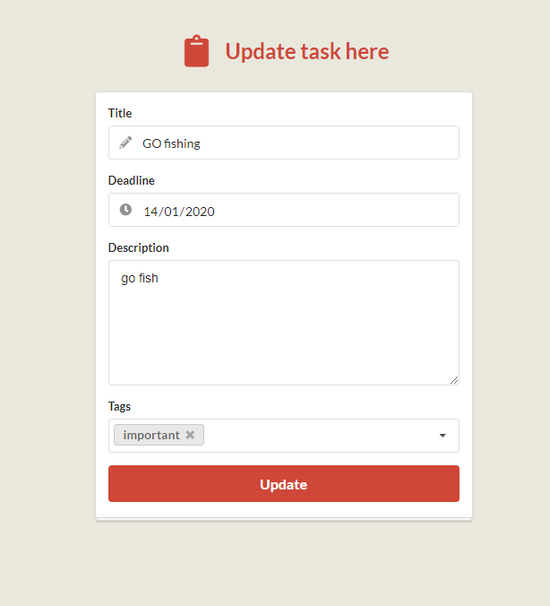

  
  
  
  

[Todo](https://todo2249.herokuapp.com/) is a web application that I created for my CVWO application. The project aims to help users to keep track of their todo. The backend was created using Ruby on Rails, which was my first time learning. The application allow users to add, edit, remove and view todos and also have tagging feature so that users can filter by tags.

Source: <a href="https://github.com/AndreWongZH/CVWO_2019-2020"><i class="large github icon"></i>CVWO Project</a>